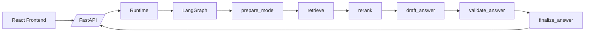

# Research Agent

Research Agent is a full-stack paper assistant built for real research workflows: upload PDFs, ask grounded questions, compare papers, draft in your own writing style, and run a two-reviewer debate panel on your work.

This repository includes:

- a React frontend (`research_agent.jsx`)
- a FastAPI backend (`backend/src/research_agent`)
- a LangGraph orchestration pipeline for retrieval + generation
- hybrid retrieval (dense + sparse) with reranking
- semantic chunking for long-form academic PDFs

## What It Can Do

- Paper-grounded QA with citations (`Local Brain`)
- Open conversational responses with optional paper grounding (`Global Brain`)
- Style-aware drafting (`Paper Writer`)
- Adversarial review simulation (`Reviewer`)
- Multi-paper comparison (`Comparator`)

## Architecture (High Level)



Detailed architecture docs:

- [Architecture Overview](docs/architecture.md)
- [Full Walkthrough](docs/architecture_walkthrough.md)
- [Graph State](docs/graph_state.md)

## Repository Layout

```text
.
├─ research_agent.jsx                 # Frontend app shell
├─ index.html                         # Frontend entry page
├─ docs/
│  ├─ architecture.md
│  ├─ architecture_walkthrough.md
│  └─ graph_state.md
└─ backend/
   ├─ pyproject.toml
   ├─ .env.example
   └─ src/research_agent/
      ├─ api.py                       # FastAPI routes
      ├─ runtime.py                   # Runtime + graph invocation
      ├─ schemas.py                   # API models
      ├─ config.py                    # App settings
      ├─ graph/
      │  ├─ state.py
      │  └─ builder.py                # LangGraph pipeline + reviewer arena
      ├─ retrieval/
      │  ├─ ingestion.py              # PDF -> chunks -> index
      │  ├─ chunking.py               # Semantic chunking
      │  ├─ dense.py                  # Pinecone + fusion
      │  └─ sparse.py                 # BM25-like lexical retrieval
      └─ services/
         ├─ text_generation.py        # Provider router (Groq/Gemini)
         ├─ groq_text.py
         ├─ gemini_text.py
         └─ style_memory.py
```

## Quick Start

### 1) Prerequisites

- Python 3.11+
- Node.js (only needed for frontend tooling; this repo serves static frontend directly)
- API keys for your chosen providers

### 2) Backend Setup

From repo root:

```powershell
python -m venv .venv
.\.venv\Scripts\activate
pip install -e .\backend
```

Copy environment template:

```powershell
Copy-Item .\backend\.env.example .\backend\.env
```

Run backend:

```powershell
.\.venv\Scripts\python.exe -m uvicorn research_agent.api:app --app-dir backend\src --host 127.0.0.1 --port 8010
```

Health check:

```powershell
Invoke-WebRequest -UseBasicParsing http://127.0.0.1:8010/health
```

### 3) Frontend Setup

This project currently serves the UI as static files:

```powershell
.\.venv\Scripts\python.exe -m http.server 5173 --bind 127.0.0.1
```

Open:

- `http://127.0.0.1:5173/index.html`

## Configuration

Key settings are defined in `backend/src/research_agent/config.py`.

Important environment variables:

- `GROQ_API_KEY`
- `GEMINI_API_KEY`
- `OPENROUTER_API_KEY`
- `PINECONE_API_KEY`
- `GENERATION_PROVIDER` (`auto`, `groq`, `gemini`, `openrouter`)
- `GENERATION_FALLBACK_ORDER` (default: `gemini,openrouter,groq`)
- `GENERATION_PROVIDER_COOLDOWN_SECONDS` (default: `600`)
- `GROQ_MODEL` (default: `llama-3.3-70b-versatile`)
- `GEMINI_MODEL` (default: `gemini-2.0-flash`)
- `OPENROUTER_MODEL` (default: `openai/gpt-4o-mini`)
- `EMBEDDING_PROVIDER` (`local`, `auto`, `gemini`)

Retrieval/chunking knobs:

- `retrieval_top_k`
- `hybrid_dense_top_k`, `hybrid_sparse_top_k`
- `hybrid_dense_weight`, `hybrid_sparse_weight`, `hybrid_rrf_k`
- `chunk_size`, `chunk_overlap`
- `semantic_unit_max_chars`, `semantic_similarity_floor`

## Modes

### Local Brain

- Strictly grounded in uploaded papers
- Uses citation-backed answers
- If evidence is missing, explicitly says it is not in uploaded papers

### Global Brain

- Conversational answer style
- Uses paper context when relevant
- Does not force citations for general knowledge responses

### Paper Writer

- Uses style memory learned from uploaded papers
- Helps draft, rewrite, and structure academic prose

### Reviewer

- Runs a structured Skeptic vs Advocate debate
- Maintains per-session debate state
- Produces verdicts and action cards

### Comparator

- Compares selected papers across methods, benchmarks, and claims

## Reviewer Arena Summary

Reviewer mode tracks:

- attack vectors
- active vector
- turn history and compressed summary
- resolution state and turn budget
- verdict per vector
- synthesis/action cards

This creates a review workflow that is more interactive than a single monolithic review report.

## API Surface

- `GET /health`
- `GET /api/papers`
- `POST /api/papers/upload`
- `DELETE /api/papers`
- `DELETE /api/papers/{paper_id}`
- `POST /api/papers/{paper_id}/re-ingest`
- `GET /api/style-profile`
- `POST /api/chat`
- `POST /api/retrieval/preview`

## Quality And Reliability Notes

- Retrieval is hybrid dense+sparse with reranking.
- If generation provider calls fail (rate limits/network), the system enters controlled fallback mode and returns debug metadata.
- Reviewer state is in-memory in the backend runtime process.

## Troubleshooting

- If answers look retrieval-only, inspect `debug.model_fallback` and `debug.model_error`.
- If citations look irrelevant, inspect `debug.retrieval_preview` and `debug.rerank_preview`.
- If UI behavior seems stale after updates, hard refresh (`Ctrl+F5`).
- If backend changes are not reflected, restart uvicorn.

## Contributing Workflow

Typical flow:

1. Create/modify feature in backend or frontend
2. Run health check + basic chat smoke tests
3. Commit with clear message
4. Push to `main` or open PR

---

For deep implementation details and rationale, read [architecture_walkthrough.md](docs/architecture_walkthrough.md).
