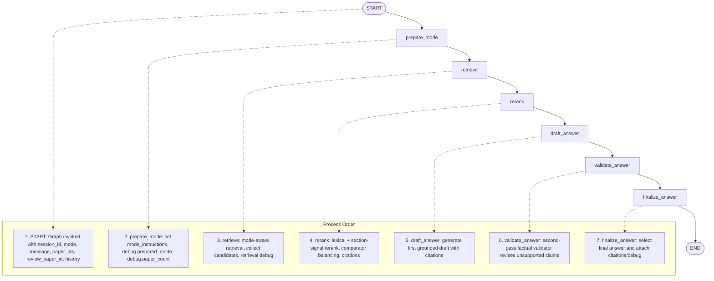

# LangGraph State Graph

This diagram reflects the exact execution order and state mutations in `backend/src/research_agent/graph/builder.py`.

## Diagram (Mermaid)

## Exact Process Order
1. START: `runtime.chat()` invokes the graph with the initial state.
2. prepare_mode: `_prepare_mode_step` sets `mode_instructions` and debug fields.
3. retrieve: `_retrieve_step` selects retrieval strategy by mode and returns candidate `retrieved_documents` with retrieval debug.
4. rerank: `_rerank_step` reorders candidates using lexical overlap, section-signal boosts, and paper balancing for comparator mode.
5. draft_answer: `_draft_answer_step` validates mode constraints and generates an initial grounded draft.
6. validate_answer: `_validate_answer_step` runs a factual verifier pass that revises unsupported claims.
7. finalize_answer: `_finalize_answer_step` selects the best final answer, returns `answer`, `citations`, and debug.
8. END: graph returns final state to the API.

## State Fields (GraphState)
- session_id
- mode
- message
- paper_ids
- review_paper_id
- history
- mode_instructions
- retrieved_documents
- draft_answer
- validated_answer
- validation_issues
- answer
- citations
- debug
